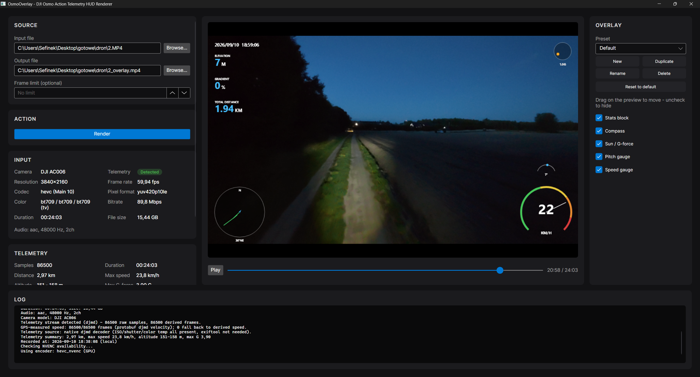

# DJI Osmo Action 6 Overlay
Not finished yet.

## Important information
Do not add the overlay in the DJI Mimo app. Doing so will slightly reduce the quality of your footage.

| Comparison                          | Original footage from the camera    | Footage exported from DJI Mimo    |
|:------------------------------------|:------------------------------------|:----------------------------------|
| Image quality                       | Full quality recorded by the camera | Slightly lower due to re-encoding |
| Resolution                          | 3840 × 2160 (4K UHD)                | 3840 × 2160 (4K UHD)              |
| Video codec in the compared footage | H.265 / HEVC, Main 10               | H.264 / AVC, Baseline             |
| Color depth                         | 10-bit                              | 8-bit                             |
| Video bitrate                       | 89.79 Mb/s                          | 79.68 Mb/s                        |
| Audio                               | AAC-LC, stereo, 48 kHz, 317 kb/s    | AAC-LC, stereo, 48 kHz, 128 kb/s  |
| Camera metadata                     | Preserved                           | Removed                           |

This application fully preserves the source codec and other original video properties, so it has absolutely no impact on the final quality after export.

Having the same resolution does not mean that the footage retains the same quality.

## Good to know
Telemetry data (GPS data, as well as your camera's serial number) is stored directly in the MP4 file. Be careful who you share it with.
