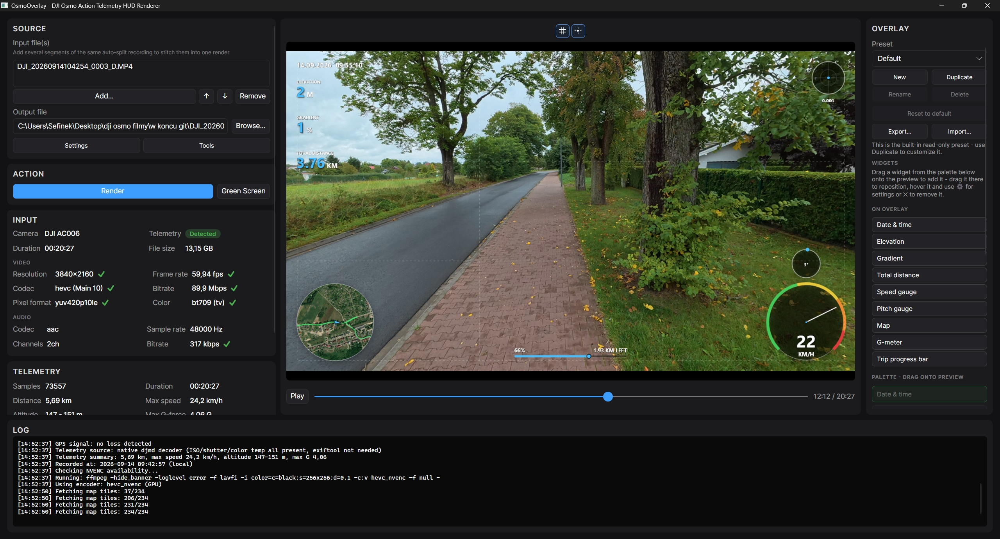

# Osmo Overlay ✨
Add a modern telemetry HUD (speed, map, route, tilt and more) to your DJI Osmo footage, straight from the data your camera already records - with no loss of image quality.

If you find this repository useful, I would greatly appreciate it if you could give it a **star** ⭐. Thank you!
Using OsmoOverlay in your videos? A mention (e.g. in your YouTube video description) would make my day 💖
Pull requests are welcome too - bug fixes, new widgets, support for other cameras, anything that makes the app better.



## Features
- **No quality loss** - the export matches the camera's original 1:1 (codec, 10-bit, bitrate, timecode).
- **Telemetry straight from the MP4** - GPS, speed, accelerometer, ISO, shutter speed and white balance. No DJI Mimo needed.
- **15 widgets** - including a speedometer, map, compass with route, tilt, G-meter, elevation, distance, date and time.
- **Drag-and-drop editor** - position, size, fonts, colors, appear animations. Presets you can export and share.
- **Live preview** - with sound, playback speed control, looping and a timeline with thumbnails.
- **Cutting** - remove parts of the recording in the app. Distance, stats and the route account for the cuts.
- **Privacy** - the camera's serial number and GPS track aren't included in the export unless you want them.
- **Green screen export** - just the HUD, for compositing in another editor.
- **Tools** - color tag fix, metadata removal, camera microphone audio conversion, video comparison.
- **Windows, Linux and macOS** - on x64 and ARM, with a GUI and a command-line version. Only the Windows version is regularly tested and considered stable; Linux and macOS are experimental.

## Supported cameras
Currently only the DJI Osmo Action 6 is supported. Unfortunately I don't own any other DJI cameras, so I can't test or add support for them. Recordings from other models may work, but this hasn't been verified.

## Important information
Do not add the overlay in the DJI Mimo app. Doing so will slightly reduce the quality of your footage.

| Comparison      | Original footage from the camera    | Footage exported from DJI Mimo    |
|:----------------|:------------------------------------|:----------------------------------|
| Image quality   | Full quality recorded by the camera | Slightly lower due to re-encoding |
| Resolution      | 3840 × 2160 (4K UHD)                | 3840 × 2160 (4K UHD)              |
| Video codec     | H.265 / HEVC, Main 10               | H.264 / AVC, Baseline             |
| Color depth     | 10-bit                              | 8-bit                             |
| Video bitrate   | 89.79 Mb/s                          | 79.68 Mb/s                        |
| Audio           | AAC-LC, stereo, 48 kHz, 317 kb/s    | AAC-LC, stereo, 48 kHz, 128 kb/s  |
| Camera metadata | Preserved                           | Removed                           |

This application fully preserves the source codec and other original video properties, so it has absolutely no impact on the final quality after export.

## Good to know
- Telemetry data (GPS data, as well as your camera's serial number) is stored directly in the MP4 file. Be careful who you share it with.
- The same resolution doesn't mean the same quality - the codec, color depth and bitrate matter too.

## Download
Every release comes in two variants for each platform:

| Variant               | .NET runtime                                                                          | Size    |
|:----------------------|:--------------------------------------------------------------------------------------|:--------|
| `self-contained`      | Included - nothing else to install                                                    | Larger  |
| `framework-dependent` | [.NET 10 Desktop Runtime](https://dotnet.microsoft.com/download/dotnet/10.0) required | Smaller |

Pick the archive for your system:

| System                | Package                                              |
|:----------------------|:-----------------------------------------------------|
| Windows (Intel/AMD)   | `OsmoOverlay-<version>-win-x64-<variant>.zip`        |
| Windows (ARM)         | `OsmoOverlay-<version>-win-arm64-<variant>.zip`      |
| Linux (Intel/AMD)     | `OsmoOverlay-<version>-linux-x64-<variant>.tar.gz`   |
| Linux (ARM)           | `OsmoOverlay-<version>-linux-arm64-<variant>.tar.gz` |
| macOS (Intel)         | `OsmoOverlay-<version>-osx-x64-<variant>.tar.gz`     |
| macOS (Apple Silicon) | `OsmoOverlay-<version>-osx-arm64-<variant>.tar.gz`   |

Each package contains both the app (`OsmoOverlay`) and the command-line renderer (`OsmoOverlay.Cli`). Checksums are in `OsmoOverlay-<version>-SHA256SUMS.txt`.

### Windows
The easiest way is the installer: `OsmoOverlay-<version>-win-x64-setup.exe` (or `win-arm64`). It installs for your account into `%LocalAppData%\Programs\OsmoOverlay`, without administrator rights, and adds desktop and Start menu shortcuts and an uninstaller. It's based on the `self-contained` variant, so nothing else is needed. An installed copy checks for new versions on startup and can update itself (also from *Settings* → *About*): it downloads the new installer, verifies it, replaces the old version and starts again.

Alternatively, extract the zip and run `OsmoOverlay.exe`.

The builds aren't code-signed yet, so SmartScreen may warn on first launch - choose *More info* → *Run anyway*.

### Linux
```sh
tar -xzf OsmoOverlay-<version>-linux-x64-self-contained.tar.gz
./OsmoOverlay-<version>-linux-x64-self-contained/OsmoOverlay
```

### macOS
Extract the archive and move `OsmoOverlay.app` to *Applications*. The app isn't signed or notarized yet, so macOS blocks the first launch - right-click it and choose *Open*, or remove the quarantine flag:
```sh
xattr -dr com.apple.quarantine /Applications/OsmoOverlay.app
```
The command-line renderer is inside the bundle: `OsmoOverlay.app/Contents/MacOS/OsmoOverlay.Cli`.

## Requirements
**FFmpeg 9** is required - both the `ffmpeg`/`ffprobe` commands and its shared libraries (used by the live preview). If it's missing, the app offers to install it on first launch:

| System  | Installed with                                                                        |
|:--------|:--------------------------------------------------------------------------------------|
| Windows | `winget install Gyan.FFmpeg.Shared` (the static `Gyan.FFmpeg` build has no libraries) |
| macOS   | `brew install ffmpeg`                                                                 |
| Linux   | Your package manager (`ffmpeg` on apt/dnf/pacman)                                     |

Many Linux distributions still ship an older FFmpeg - the preview needs version 9.x.

[ExifTool](https://exiftool.org) is optional. It's only used as a fallback for cameras whose telemetry format the app can't read on its own.

## Building from source
Requires the [.NET 10 SDK](https://dotnet.microsoft.com/download/dotnet/10.0).

```sh
dotnet run --project OsmoOverlay.Gui                     # run the app
dotnet test --project OsmoOverlay.Tests                  # run the unit tests
dotnet run --project OsmoOverlay.Build                   # build every release package into artifacts/
dotnet run --project OsmoOverlay.Build -- --help         # options: platforms, variant, version, output directory
```
Packages for all platforms can be built on any system (Windows, Linux or macOS).

## License
OsmoOverlay is free for non-commercial use under the [PolyForm Noncommercial License 1.0.0](LICENSE).

- You can use, modify and share it (including modified versions) for any non-commercial purpose.
- The videos you make with it are yours: you can monetize them and publish them as sponsored content, and you can use the app itself for paid editing work for clients.
- You can't sell the app or a modified version of it, or include it in a paid product or service.

The second point is an additional permission from the licensor on top of the license: using OsmoOverlay to create videos and other output, and using that output for any purpose, including commercial ones, is permitted. See [LICENSE](LICENSE) for the full terms.
